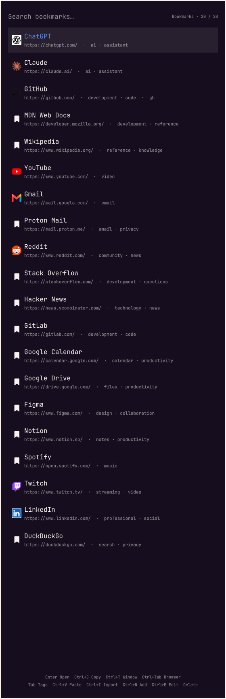

# Bookmarks for Omarchy

A quiet, keyboard-first bookmark launcher for Omarchy. It is a Quickshell
overlay styled like a compact browser address bar, backed by a resident Rust
worker and SQLite.

The closed launcher consumes no window space. When opened it shows a centered
search field with the most-used bookmarks—or, when configured, the most
recently used bookmarks—in individual result rows. Search results replace
those rows after typing in a scrollable three-to-ten-row
window, according to the user's setting. Literal query matches are highlighted
in result titles and URLs.



## Installation and first use

Install and enable the plugin from GitHub:

```bash
omarchy plugin add https://github.com/StefanMarAntonsson/omarchy-bookmarks.git --enable
```

Enabling an overlay makes it available to Omarchy, but does not open it or add
a launcher. Open it once with:

```bash
omarchy-shell shell summon stefanmara.bookmarks '{}'
```

On first open, press **Enter** or choose **Set up worker**. Setup runs in a
visible terminal and explains whether it downloaded the worker pinned by this
plugin or built the bundled source. Read the result and close the terminal;
Bookmarks then returns automatically. An existing v1 library is migrated at
this point. A new empty library offers **Add bookmark**, **Import from browser**,
and **Load examples** as its first actions.

### Choose how to open Bookmarks

A main-menu entry is the recommended discoverable default. A keybinding is a
useful optional shortcut. The plugin does not silently change either shared
configuration file, so the choice and key combination remain yours.

To add a main-menu entry, edit
`~/.config/omarchy/extensions/omarchy-menu.jsonc` and add the following property
inside its outermost object (include a comma between it and another property):

```jsonc
"stefanmara-bookmarks": {
  "icon": "",
  "label": "Bookmarks",
  "action": "omarchy-shell shell summon stefanmara.bookmarks '{}'",
  "when": "omarchy plugin list --json 2>/dev/null | jq -e 'any(.[]; .id == \"stefanmara.bookmarks\" and .enabled == true)' >/dev/null"
}
```

Omarchy watches that file, so a valid edit appears without a restart. If the
file is new, wrap the property in `{` and `}`. Removing that property removes
the entry.

For a direct shortcut, first review the existing bindings with
`omarchy-menu-keybindings`, then add an unused combination to
`~/.config/hypr/bindings.lua`, for example:

```lua
o.bind(
  "SUPER + B",
  "Bookmarks",
  "omarchy-shell shell summon stefanmara.bookmarks '{}'"
)
```

Hyprland reloads this file automatically. Replace `SUPER + B` if it is already
assigned.

## Upgrading from v1

The move from v1.0.4 to v2 is a major upgrade, but it does not require an
export. Update the existing Git-managed installation with:

```bash
omarchy plugin update stefanmara.bookmarks
```

Then open Bookmarks and complete **Set up worker** as described above. On the
first successful v2 worker start, the version-3
`bookmarks.json` used by v1 is validated and migrated to SQLite. IDs, URLs,
titles, tags, keywords, usage scores, and last-opened times are retained. The
original JSON remains untouched and a private timestamped migration backup is
created before anything is imported.

The stable plugin ID is unchanged. Existing v1 main-menu entries and direct
keybindings therefore continue to open v2 on supported Omarchy versions.
These intentional behavior changes are worth knowing:

- Favicons are not imported or displayed. The rest of an entry containing a
  valid v1 favicon still migrates.
- The old `settings.json` is left in place but is not imported. v2 starts with
  its new defaults, including website detail fetching **off**, so an old
  network opt-in never silently carries forward.
- Keyword values remain searchable, but v1's parameterized keyword expansion
  is not yet exposed in the v2 interface.
- `Ctrl+S` now opens all settings and library actions. Import is under
  **Settings → Library**, deletion is `Ctrl+D`, and adding a URL is `Ctrl+N`.
  The old `Ctrl+M`, `Ctrl+I`, `Ctrl+V`, `Ctrl+,`, and plain `Delete` behaviors
  are not carried forward.

Do not use v1 to make changes after v2 has migrated the library. v1 writes the
preserved JSON while v2 writes SQLite, and the two stores are not synchronized;
v1 changes made after migration will not appear in v2. If a rollback is
necessary, treat it as a data restore and keep copies of both stores rather
than switching versions back and forth.

## Architecture

- `Bookmarks.qml` owns presentation, focus, keyboard handling, bounded result
  rows, selection previews in the input, and compact edit/delete modes.
- `WorkerClient.qml` owns one managed child process, version-1 newline-delimited
  JSON framing, response validation, and stale-response IDs. Ordinary requests
  have a 20-second deadline and explicit library operations have a two-minute
  deadline; a worker that stops responding is terminated and every outstanding
  request is resolved with an error. Crashes after a successful
  handshake restart with bounded exponential backoff (at most five times until
  the overlay is reopened); startup failures are reported and not retried in a
  loop.
- `src/main.rs` is the protocol/server loop. Linux parent-death signaling stops
  it when `omarchy-shell` exits.
- `src/repository.rs` owns SQLite, numbered migrations, CRUD, foreign keys,
  legacy migration, and the refreshed in-memory index.
- `src/search.rs`, `src/url_key.rs`, and `src/metadata.rs` own ranking,
  conservative duplicate keys, and bounded HTTP metadata retrieval.

QML never reads SQLite, performs network requests, or scans the bookmark
collection. Requests are limited to 64 KiB (measured in UTF-8 bytes, and read
without buffering more than that) and responses to 256 KiB. Search returns at
most ten bookmarks per page, shortened further when needed to stay within the
response limit, and loads further matches while scrolling. A response that
would still exceed the limit becomes an error for that request; the worker
never exits because of it. All text, including bookmark titles, tags, browser
names, and errors, is rendered as plain text.

## Runtime requirements

The worker launches existing desktop tools and does not install software:

| Tool | Used for |
| --- | --- |
| `omarchy-launch-browser` | Opening URLs in the default browser |
| `wl-copy` | Copying a bookmark URL |

Launched helpers are waited on so the long-running worker does not accumulate
zombie processes. URLs, including stored ones, are validated as HTTP(S)
immediately before every launch.

Setup uses `sha256sum`, `flock`, and `curl` for a pinned release, or a Rust 1.96
or newer toolchain (`cargo`) when building from source, and
`omarchy-launch-tui` to show its terminal.

## Worker setup and verification

The plugin contains no executable. The first time Bookmarks opens without a
worker, it shows **Set up worker**. Pressing Enter opens a terminal running
`scripts/install-worker.sh`, which:

1. Reads `worker-release.pin`, which records the release version, the worker
   source fingerprint, and the SHA-256 of each released executable. The pin is
   part of the reviewed plugin commit.
2. If this checkout's worker source matches the pinned release, downloads that
   exact version (never "latest") for x86_64 or aarch64 from this repository's
   GitHub releases over HTTPS, with size and time limits.
3. Installs it only if its SHA-256 equals the pinned hash. A mismatched download
   is discarded.
4. Otherwise (no release pinned, unsupported architecture, no network, or a
   mismatch) builds the plugin's own source with `cargo build --locked
   --release` in `~/.cache/stefanmara.bookmarks/target`. Without cargo, setup
   stops and says so.
5. Checks that the candidate reports this plugin's version, then atomically
   installs it to `$XDG_DATA_HOME/stefanmara.bookmarks/bin/` (mode 0700) with a
   record of its hash and source fingerprint. It refuses symlinked install
   locations and concurrent runs.

Setup only runs when you ask for it; loading the plugin never downloads or
builds anything. After the setup terminal closes, the overlay returns and
starts the newly installed worker. If setup failed, it returns to the setup
prompt so you can retry after addressing the terminal's error.

`worker-launcher.sh` starts the worker only when the installed executable's
hash matches its record and the record's source fingerprint matches this
checkout's source (`scripts/worker-source-id.sh`: `Cargo.toml`, `Cargo.lock`,
and every `.rs` file under `src/`). After a plugin update that changes the
worker, or if the executable is modified, the overlay asks for setup again
instead of running it.

The data, backup, and worker-install directories are kept at mode 0700. The
worker refuses a symlinked data directory rather than following it.

To verify a release yourself:

```bash
gh release download v2.0.0 --repo StefanMarAntonsson/omarchy-bookmarks
sha256sum --check SHA256SUMS
gh attestation verify omarchy-bookmarks-worker-x86_64 \
  --repo StefanMarAntonsson/omarchy-bookmarks \
  --cert-identity https://github.com/StefanMarAntonsson/omarchy-bookmarks/.github/workflows/release.yml@refs/tags/v2.0.0 \
  --source-ref refs/tags/v2.0.0 --deny-self-hosted-runners
```

Then compare the hashes with `worker-release.pin`. How releases are built and
pinned is described in [docs/RELEASING.md](docs/RELEASING.md).

## Development and validation

```bash
cargo fmt --all -- --check
cargo clippy --all-targets -- -D warnings
cargo test --all-targets
cargo audit
shellcheck worker-launcher.sh tests/run scripts/*.sh
./tests/run
omarchy plugin validate .
```

The test suite uses temporary SQLite databases and deterministic loopback HTTP
servers. It does not contact public websites or migrate the live store.

After changing worker source, install your build with:

```bash
scripts/install-worker.sh --from-source
```

The launcher refuses a worker built from different source, so the overlay asks
for setup until you do. `cargo test` and `./tests/run` build inside `target/`
in the checkout; if the checkout is linked as your active plugin, Omarchy may
reload it while they run.

For local development, build and validate first. Only then link or install the
checkout under `~/.config/omarchy/plugins/stefanmara.bookmarks`. Changing the
active shell configuration is deliberately not part of the build.

Open the enabled plugin with:

```bash
omarchy-shell shell toggle stefanmara.bookmarks '{}'
```

## Keyboard controls

| Key | Action |
| --- | --- |
| Empty input | Show the configured number of most-used or recently used bookmarks as individual result rows |
| Type | Search; results replace the default rows |
| `Tab` | Switch between bookmark search and tag-only search |
| `Up` / `Down` | Change selection and preview its URL while searching |
| Edit a previewed URL | Clear the bookmark selection and use the field as a direct URL |
| `Enter` | Open the selected bookmark, the first search result when none is selected, or a valid HTTP/HTTPS URL in the field |
| `Ctrl+Enter` | Open the selected bookmark, first result, or direct URL using the opposite of the configured opening behavior |
| `Ctrl+1` – `Ctrl+9`, `Ctrl+0` | Open results 1–10 directly |
| `Ctrl+Alt+1` – `Ctrl+Alt+9`, `Ctrl+Alt+0` | Open results 1–10 using the opposite of the configured opening behavior |
| Hold `Ctrl` | Replace the selected row with its actions and reveal result-row shortcuts; an empty input shows add, paste, and settings shortcuts |
| Hold `Ctrl+Alt` | Reveal the inverse numbered shortcuts and whether they open in a new tab or window |
| `Ctrl+N` | Add a bookmark, prefilling a valid non-duplicate URL from the field |
| `Ctrl+S` | Open settings |
| `Ctrl+E` | Edit the selected bookmark |
| `Ctrl+D` | Request deletion of the selected bookmark; `Enter` confirms |
| `Ctrl+C` | Copy the selected URL |
| `Escape` | Step back from a URL preview/edit to the search, clear a non-empty search, then close from the empty view |

Settings use the same in-card form as adding a bookmark. They control the
default search scope, whether an empty search shows the most-used (the default)
or most recently used bookmarks, whether three through ten results are visible
(the settings row shows as many choices as fit the window), whether
bookmarks open in a new tab or a new browser window, and whether pasting a URL may
contact its website to suggest a title and description. Changes are saved in
the SQLite database and apply immediately after saving as well as on future
launcher opens. Website lookups are off by default because they disclose the
requested URL and the user's IP address to the destination.

Within Settings, `Up` and `Down` move to the closest control in the adjacent
row. `Left` and `Right` move within the current row and wrap at either end.
Normal `Tab` and `Shift+Tab` focus traversal remains available.

When page-detail fetching is enabled, metadata suggestions never block saving.
A late response fills title or description only if the user has not edited that
field. Suggested tags are local, deterministic, limited to four, and require a
click to accept.

## Library: import, backups, and examples

The **Library** section of Settings (`Ctrl+S`) has five actions. Lists use
`Up`/`Down` and `Enter`; `Escape` goes back one step.

- **Import from browser** lists detected profiles of Firefox, Zen, LibreWolf,
  Floorp, Waterfox, Chromium, Chrome, Brave, Vivaldi, Edge, Helium, Thorium, and
  Opera, including Flatpak installs. Choosing one shows how many bookmarks are
  new, already saved, or skipped, and nothing is written until you confirm.
  Only HTTP(S) bookmarks are added, with their titles, Firefox tags and
  keywords, and the date they were added. Bookmarks you already have are left
  unchanged.
- **Back up now** saves a copy of the library.
- **Restore backup** lists backups with their date, reason, and size, and
  replaces the bookmarks and tags with the chosen one after confirmation.
  Settings are kept.
- **Load examples** replaces the library with about two dozen example
  bookmarks, for trying the launcher or taking screenshots.
- **Clear all** deletes every bookmark after confirmation.

Import, restore, loading examples, and clearing each save an automatic backup
first (unless the library is empty), so any of them can be undone with
**Restore backup**.

Backups are complete SQLite copies made with `VACUUM INTO`, saved with mode
0600 in:

```text
$XDG_DATA_HOME/stefanmara.bookmarks/backups/bookmarks-<UTC time>-<reason>.sqlite3
```

The newest 20 automatic and 50 manual backups are kept. A restore accepts only
a backup name from that directory, opens the file read-only, and refuses it if
SQLite's integrity check fails, the tables are missing, it comes from a newer
schema, or it exceeds the store limits. Restores run in one transaction.

Browser data is read without changing it. Chromium-family `Bookmarks` files
are read directly. Firefox-family `places.sqlite` (and its write-ahead log) is
copied into a private temporary directory, read there, and deleted, so a
running browser is never affected. UUID-named scratch directories left by a
terminated worker are removed before the next import. Files are opened without
following symlinks and with size, entry-count, and folder-depth limits. The
worker only reads a profile that its own discovery found; a request cannot name
another file.

## Data migration, rollback, and recovery

SQLite is authoritative at:

```text
$XDG_DATA_HOME/stefanmara.bookmarks/bookmarks.sqlite3
```

The legacy source remains at:

```text
$XDG_DATA_HOME/stefanmara.bookmarks/bookmarks.json
```

A worker refuses to open a database with a newer SQLite schema before making
any migration or WAL changes. This protects against running an older v2 worker
against a database created by a future worker; it does not make a rollback to
the JSON-based v1 plugin safe. See **Upgrading from v1** above.

On the first worker start, when no successful migration is recorded, a valid
legacy version-3 JSON file is opened without following symlinks or blocking
on FIFOs, read from the same descriptor, and fully validated using the existing 64 MiB,
50,000-bookmark, URL, field, and duplicate limits. The worker then creates a
timestamped `bookmarks.json.migration-backup-*` (mode 0600) from the bytes that
were validated, imports bookmarks, tags,
keywords, and usage data in one transaction, preserves the original JSON, and
records success in SQLite. It will not repeat the migration.

Malformed, unsafe, duplicate, or newer-format input stops migration without
overwriting the JSON or creating a misleading success marker. The worker
reports recovery guidance in the overlay. Repair the JSON or move it aside,
then remove only the incomplete `bookmarks.sqlite3` files before restarting.
Keep the JSON and timestamped backup until the migrated library has been
verified.

The database is opened without following symlinks. Every load checks it
against the same 50,000-bookmark, 64 MiB, and per-field limits applied to new
input, so an externally edited or corrupted database fails closed instead of
exhausting memory. Adding bookmarks beyond the limit is refused.

Foreign keys are enabled on every worker connection. Tags and bookmark-tag
relations use separate indexed tables and cascade safely when a bookmark is
deleted.

## URL and metadata policy

Only fully qualified HTTP and HTTPS URLs (including the scheme) without
embedded credentials are accepted. Duplicate
keys lowercase schemes/hosts and remove only default ports. Query parameters,
fragments, paths, percent encoding, and meaningful trailing slashes remain
distinct.

Page-detail lookups are off by default. The worker itself checks the saved
setting before any request, so missing or unreadable settings never authorize
network access. When enabled:

- Only HTTP(S) URLs on default ports without credentials are contacted.
- The worker resolves host names itself and refuses the request if any
  resolved address is not public (loopback, private, link-local, carrier-grade
  NAT, multicast, documentation, and IPv6 unique-local, Teredo, 6to4, and
  IPv4-mapped private ranges). The connection uses exactly the checked
  addresses, which prevents DNS rebinding. IP-literal hosts are checked the
  same way.
- Every redirect is checked with the same rules, at most four are followed,
  and HTTPS-to-HTTP downgrades are refused.
- Proxies from the environment are ignored; no cookies, credentials, or
  referrer are sent.
- Timeouts are three seconds to resolve and connect and eight seconds overall.
  At most 1 MiB is read, only `text/html` or `application/xhtml+xml` responses
  are accepted, and at most two lookups run at once.
- Title and description are reduced to single-line plain text of at most
  2,048 characters. Error messages never echo remote content.

It supports Open Graph title/description, standard description metadata, and
`<title>`, executes no JavaScript, and embeds no browser.

## Remaining limitations

- Legacy keyword data is preserved and searchable. Parameter substitution for
  `%s`, `%S`, and `{searchTerms}` is not yet exposed by the minimal UI.
- Import reads installed browser profiles only; bookmark HTML export files and
  the old plugin JSON format cannot be imported. Browser folders are not turned
  into tags.
- Main-menu integration is a documented manual opt-in; the plugin does not
  edit shared Omarchy configuration. Favicons are not supported.

## Performance

Measured on the development machine with a release build, warm filesystem cache,
and a private SQLite migration of the real 1,181-bookmark library:

| Measurement | Result |
| --- | ---: |
| Worker startup through the `hello` response, 20-run mean | 5.25 ms |
| Idle worker RSS | 1,884 KiB |
| Empty search, 500 pipelined protocol round trips | 27.37 ms total (0.055 ms/response) |
| `github` search, 500 pipelined protocol round trips | 417.04 ms total (0.834 ms/response) |

These are measurements, not promises. They include NDJSON encode/decode and
SQLite/index startup where applicable, but the pipelined figures are throughput
rather than interactive percentile latency. Hardware, library size, filesystem
cache, and system load will change them.

## License

[MIT](LICENSE)
